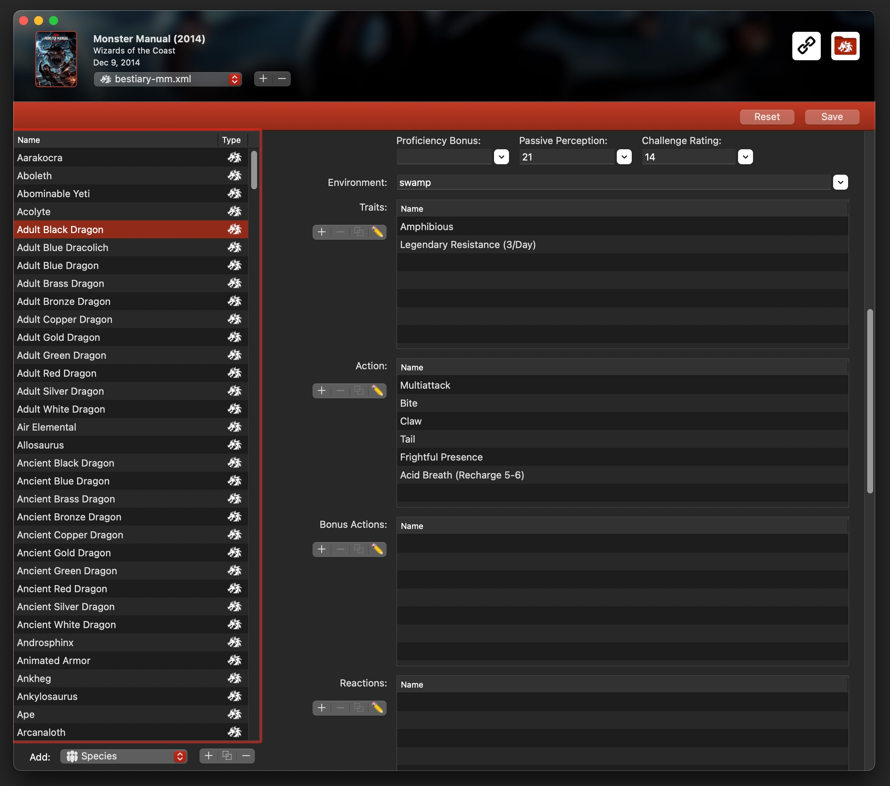

# The Compendium Editor: A Guide

If you're new to creating and adding custom content to Fight Club or Game Master 5th edition, things like XML files can seem a bit overwhelming at first. And even when you manage to get a good grasp of those, it's still a lot of work to format everything just right.

I made the Compendium Editor so that I wouldn't have to worry about the technical aspects and be able to focus on adding more content to the compendium, as well as adding some basic but much needed ways to clean up texts. And along the way, added some extra features here and there to further automatize and simplify adding content.

While most of the app should be pretty straightforward, I'm sure some parts could use some additional explanation. And there are a few features and shortcuts which aren't immediately obvious which I would like to share.

---

## Adding sources and getting started!

1. When you're opening the app for the first time, you will be asked to select a folder to add to the compendium editor. You can add more sources by going to the 'File' menu and selecting 'Add Source Folder'.

2. If you have previously downloaded the [github compendium](https://github.com/vidalvanbergen/FightClub5eXML) by cloning the repository or clicking on the green code button and choosing the option to "Download ZIP", you can get started quickly by selecting the 'Sources' and/or 'Sources_2024' folders. Or you can create a new empty folder to work with. 

\[*I like to add preview images to more easily find what I'm working with.*\]

3. To add a new content folder, press the '+' button at the bottom while having an item selected to add the folder to. A dialog will pop up to prompt you for a name. Conversely, pressing the '-' button will ask you whether you want to delete the currently selected item.

4. When you want to add or edit content, select an item from the list and press on the 'pencil' button in the toolbar, double click on the list item, or click on the 'Compendium' menu and select 'Edit Source'.

5. The first page you will see is the source information editor. Here you can add information about the source such as its name, an abbreviation to use when creating new files, the publisher, author and artist's names. A category which is used to distinguish it when you want to compile all the compendiums together. A url for where people can find and possibly purchase the content, and a link to the author or publisher's website. A date for when the work was published, and a text field where you can fill in a brief summary or description of the source. Make sure to press the 'save' button when you are done!

6. On the top right of the window are one or two buttons visible, depending on whether you've added a website URL. The button with the chain link image will send you to the publisher's website when available. And the one with the dragon's head folder image will open the folder you are currently working on.

7. Press on the dropdown menu where it says source to switch to the cover image panel, or if you've added more files, switch to the .xml file you wish to add content to. I like to add preview cover images to make it more easy to find what I'm working with, but this is optional, and aren't included in the repository.

8. Pressing on the '+' next to the menu brings up a prompt asking you which file you would like to add. You can pick one of the default given names, or add your own. To add a file for a specific class, choose the 'class-classname-\*\*\*.xml' (where \*\*\*) is the optional abbreviation you've given to the source in step 5. 'Optionalfeatures' are for features such the warlock's eldritch invocations, 'spells-\*\*\*+phb' is for adding subclass spells and adding new classes to existing spells.

*Now, we get to work on the fun stuff!*

----

## The Editor

A couple of useful tidbits:

0. If you hover the cursor over any field for a bit, a short description of what the field is for should pop up as help text.

1. When you see a field with an 'I'nformation button next to it, this indicates that the field isn't officially supported by either Fight Club or Game Master. Instead they've been added with the idea in mind that they might be useful for other applications in the future, giving extra information not usually available.

2. You will see a lot of text fields with a button next to it. Most often these will give you a list of quick options to choose from to fill the field with. Add other times, these will give you additional options for text formatting, or adding dice rolls.

3. Some fields have a series of buttons with a '+', '-', '⿻', and '✏️', these are for adding, deleting, duplicating and editing selected items in the related lists respectively.

4. You may have noticed an extra button here and there next to the name field with a clipboard icon in it. This button will try to read through the text you have currently copied, find the correct fields to fill, and do some basic formatting on the text. You can use this to, for example:
   * Copy an entire spell block, and have it try to fill in the level, school, duration, action time and other information all at once.
   * Copy a single feature/trait/action and have it detect the name, text, available uses, and optional dice rolls.
   * For subclass features, first press on the dropdown menu and select the 'FeatureName (\[Name of the currently selected subclass\]), and then on the clipboard button. It will then replace 'FeatureName' with the detected name of the feature you want to add.

5. The magic button is truly magic! You will find these wherever you can add dice rolls. After adding an item's descriptive text, press on the button to have it scan for all possible dice rolls and matching damage types (not supported by FC or GM). When adding dice rolls to spells, it can even add spell levels (Also not officially supported) when damages differ if cast 'At Higher Levels' or has a 'Cantrip Upgrade' feature. (It will look for these labels inside the text to know which one to use.)
   * For creature attacks, this will add the damage type, 'to hit' when available, and the damage roll. It will add a roll if there's a two-handed option available, and if there are multiple damage types it will add rolls for each damage type, as well as add a summary roll on top with all the damage rolled into one.

6. Sources are comma separated. If the option to sort these as a vertical list is selected, the app will format these according to the placement of the commas, so it's best not to include commas inside a source's name.

7. When editing descriptions, you may find some helpful tools in the dropdown button next to the field.
   * Templates, these are usually some commonly used text snippets you can add at the bottom of the description.
   * Format lists, this option will try to detect list items, and format them by indenting them with a tab, and using a bullet '•'.
   * Format paragraphs with spacing, this will quickly format the text, and separate the different paragraphs with extra line endings.
   * Format paragraphs with indent, this will quickly format the text, as above, but instead separate different paragraphs by indenting the next line. I like to first format the text with spacing, to make sure it detected the different paragraphs correctly, and make any necessairy edits. Then use the format with indent option.
   * You can use the keyboard shortcuts cmd/ctrl + K for quickly formatting paragraphs with spacing, and cmd/ctrl + L for formatting with indent.

----

### Adding spells, subclass spells, and optional class feature spells

1. When adding a spell item, you can choose a type:
   * Spell, your basic spell block.
   * Subclass spell, a simplified spell block with just a name and subclasses.
   * Class Feature, a slightly modified spell block for use to add optional class features such as artificer infusions and warlock eldritch invocations.

2. For subclass spells, you can use the dropdown menu next to the name to select a pre-existing spell from the Player's Handbook, Xanathar's Guide to Everything and Tasha's Cauldron of Everything, or select the option to correctly format the capitalization of the spell name. Make sure these match existing spell names **Exactly** for merging! They are capital sensitive.

3. For class features, you should always add a level, usually 'Cantrip' to make sure Fight Club can make proper use of it. In the 'Feature Type' field, you should add what kind of feature it is, like 'Infusion' or 'Invocation', this will get added before the feature's name like so: "Invocation: Agonizing Blast". The 'Prerequisite' field will be added at the top of the description as 'Prerequisite:' followed by the description you've added. (The special traits and modifier fields are not officially supported by Fight Club, but may be used by other applications like they are with Feats.) You can add a name for the spell list you will find these features in under the sub/classes.

4. The 'magic' button next to the dice rolls will try to auto-detect the dice rolls within the spell's description. If the description contains either 'At Higher Levels" or 'Cantrip Upgrade', it will add them to the rolls to mark them for which spell slot level they are used at. The roll description is typically used describe the damage type, whether it's used to 'Heal' a player, or give 'Temporary Hit Points' and other such short summaries. (The level and description aren't officially supported by Fight Club, but may add extra functionality in other apps in the future.)

----

### Treasures and Magic items

1. When adding an item, you can choose to load a 'template' of an existing weapon or armor. This can be useful when you want to add a magical variant of an existing weapon. The templates are made out of all the items found in the PHB and official source books, and with pre-formatted descriptions as I've added them in my repository.

2. The Category field is an optional field which I tend to use to write the original name of the item when encountering a named magic item, like 'greataxe' for 'Adze of Annam', or to add a type like 'spellcasting focus', 'food', 'tool' and other useful descriptors. These will get added before the rarity in the details field.

3. The 'magic' dice roll button will do it's best to add all the discovered dice rolls from the text, as well as a short description such as the damage type, whether it's meant to 'heal' or give 'Temporary Hit Points' to a player, or how many charges it will 'Recharge' when applicable. (The short description is not used by fight club, but may be used in other apps.)

4. Given you copied an entire item's block of information to the clipboard, you can use the 'Import from Clipboard' button to try and fill all the fields at once! It's not perfect since different sources may use different formats, but it should speed things up considerably.

5. Using the description fields' dropdown menu, you can quickly add text snippets from templates for common weapon and item properties, status descriptions and poison types.

---

### Backgrounds and Origins

1. Backgrounds are mostly straightforward to create. You add a name, optional proficiencies, source and features.

2. The 'Origin Background' field is used to write down which background was used in case of a variant. Though this isn't officially used in Fight Club. Likewise I've added an option to add dice rolls to background features which also isn't official, though may be used somehow in other apps in the future.

3. When adding a feature, you can use the dropdown menu next to the description field to quickly add all the characteristics lists, ready to be filled in.

4. The 'Import from clipboard' button will attempt to import a feature you have copied.

---

### Feats

1. Feats are pretty simple. It includes an import from clipboard button which will try to recognise name, description and prerequisites.

2. You can add proficiencies, special traits and modifiers. You can set skill to add proficiency to, or if the character is already proficient, add a variant with a 'skill' modifier instead of a proficiency that adds proficiency bonus to a skill to give them expertise in that skill.

---

### Species

1. I like to use a sort name option for species with subspecies in order to group several of the same together in the list, such as 'Elf, High' and 'Elf, Wood'.

2. I've been adding some creature and class option fields that aren't officially supported with the idea that other apps may use these to add a species' bonus proficiencies to their lists. These are subjected to change and may either be removed or expanded in the future.

3. Another optional field that isn't officially supported are adding dice rolls to features, since some species add options for natural weapons with their own damage rolls.

4. The dropdown menu to a feature's description contains template texts for a few common features, such as 'darkvision' and 'powerful build'.

5. I've added another optional 'category' tag which can divide 'description' features, features that are part of a major 'species', and 'subspecies' variant features. These are also not officially supported by Fight Club, but may be useful in other apps.

6. The import from clipboard button will attempt to detect a feature's name and description.

---

### Classes and Subclasses

1. To add a new class, create a file named class-\[classname\]-abbriviation.xml, select 'Class and Subclass' from the dropdown menu at the bottom of the list, and press the '+' button. A new class will be created using the filename to guess at the class's name.

2. If you are adding a new or homebrew class, select 'Main Class Features' from the dropdown button underneath 'Name', and fill in the fields, specifically make sure to add a 'Hit Dice' number to mark it as its own class, and not a class containing only subclasses.

3. You can add optional class traits, which aren't officially supported by Fight Club. These are used to describe the class.

4. The spells table contains a 'Spells Known' column, these are added as a counter to the class which will show up in the 'Statistics' block in Fight Club. I also like to add a textual table for spells known to the 'spellcasting' feature to give players a quick overview.

5. To add ability score improvements options at certain levels, you need to add at least one feature at that level. A good way to do this is add an 'Ability Score Improvement' feature, duplicate this feature for every level that you need it for, then add the 'Improvement Levels' via the field just above features.

6. You can edit a level by clicking on the number next to a feature and changing it.

7. Dice rolls are an optional field for features that isn't officially supported by Fight Club, but may come in handy some day in other apps.

8. If a feature contains a mention along the lines of 'You can use this feature once per short and long rest', you should select that feature in the list, then press the '+' button next to the trackers list. It will automatically add a tracker with the feature's name and level. You can change the level, name and value by clicking on them. Clicking on 'short' or 'long' under the 'Reset' column will give you options for which type of rest is required before the counter is reset. An optional 'subclass' field will list all the subclass options you've added, this is not officially supported by Fight Club but may give a future app developer extra options.

9. The spell list takes a comma separated list of spell names, and on saving the class will add these as 'subclass spells' to the file. If multiple subclasses use the same spell, they will be added to the same spell item. Using the dropdown option, you have several ways to automate and format spells, as well as access a list of spells from the Payer's Handbook, Tasha's Cauldron and Xanathar's Guide.
   * Format spells, will a suggested, format your spells. This includes proper capitalization of spell names, as well as use a list of spells copied directly from a subclass with included levels, and convert it into a comma separated list.
   * Add '\[2024\]' tag, which will add said tag after every spell name for use with the 2024 classes.

#### Adding subclasses:

10.  You can add subclass features with or without filling in the main class's fields by pressing the '+' button after the 'Subclass' dropdown menu, which will prompt you for a subclass name you wish to add.
   * Note: Subclasses are automatically detected only if you have a feature with 'archetype: subclassname' followed by a feature called 'featurename (subclassname)' or 'subclassname: featurename'. If you find a feature you added is missing later, check the 'Main Class Features' to see if it's been moved there, and make sure to add the subclass to its name. Optionally, you could add them to the main class's feature list directly and have the app recognise them later.

11. After adding a subclass, add a feature. Make sure that the 'Optional' field is set to 'YES' so it won't be automatically selected when leveling up a character. Next to the name field, there's a dropdown field with a few pre-selected options such as 'archetype: subclassname', 'FeatureName (subclassname)'. These will automatically use a detected 'archetype' and the currently selected 'subclass' where needed.

12. When importing a copied feature from the clipboard, make sure to already have 'FeatureName (subclassname)' already selected, it will replace 'FeatureName' with the name of the feature while leaving the subclass' name as formatted.

----

### Creatures and NPCs

1. There are a lot of fields to fill in, depending on the creature's stat block. Pressing the up or down key with a number field selected will increase or decrease its value by one.

2. When adding features to creatures, you can select the entire trait or action and copy it, then use the 'import from clipboard' button to have the information correctly sorted out and dice rolls automagically detected.

3. Bonus actions are not technically supported by Fight Club for some reason, instead it will add '(Bonus Action)' after the name of an action when saving. And will read actions with that tag into the bonus actions list.

4. Lair actions and traits aren't officially supported in Fight Club, but you can still include them. If you add them to the Lair Actions list, they'll be saved under Legendary Actions and Fight Club will display them after any other legendary actions. Internally, any legendary feature with "lair" in its name or tagged with the category "Lair" is treated as a lair action.

5. Similarly to classes, a creature can have a comma separated list of spells. Though due to an odd bug in the Fight Club and Game Master app, they won't match and show up in Fight Club as they should unless you import the compendium twice (overwriting the previous import). The 'Format Spells' option in the dropdown menu can convert most common spell lists from a feature into a comma separated list.

6. The Spell Slots field is where you define how many spells your creature can cast per level. You'll enter the numbers as a comma-separated list, starting with 0 for cantrips (since they're cast at will and don't use slots).

## Compile a complete compendium

1. Once you're done adding your own content, go back to the main window, and press on "</>" in the toolbar to open the compendium compiler.

2. Select which sources you want to merge and compile into a single compendium file, then press the up arrow in the toolbar to save the new file into a location of your choice.

3. After saving the file, move it to the machine containing the fight club app, and follow the instructions from my '[How to: import your compendium!](https://www.patreon.com/posts/how-to-import-124424034)' guide.

----

## Conclusion

Hopefully this guide has helped you get a better feel for how to use Compendium Editor and cleared up some of the trickier or less obvious features. If you run into bugs, have suggestions, or just want to share something cool you've created, feel free to [reach out on GitHub](https://github.com/vidalvanbergen/CompendiumEditor) or message me on [Patreon](https://www.patreon.com/viannadnd). Your feedback is always welcome!

Thank you for all your support, and have fun creating more content!