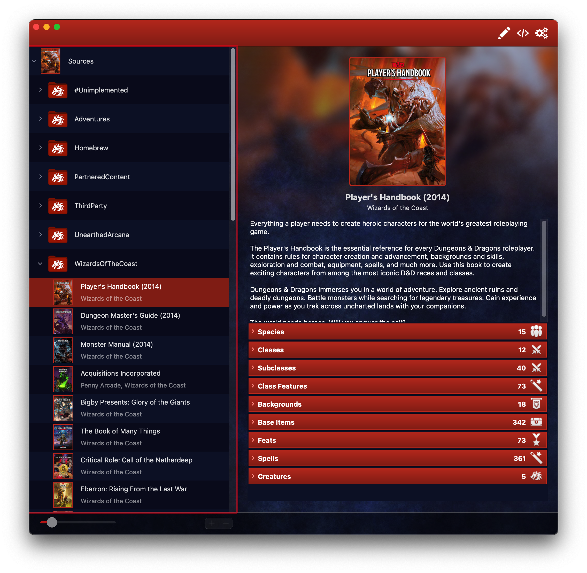

# Compendium Editor

A companion app for Fight Club 5e and the [FightClub5eXML repository](https://github.com/vidalvanbergen/FightClub5eXML) to more easily create and edit XML files and compendiums to import into the app.

It will also help by giving some handy formatting tools to import features directly from the clipboard, and format text blocks into neat paragraphs and lists.

